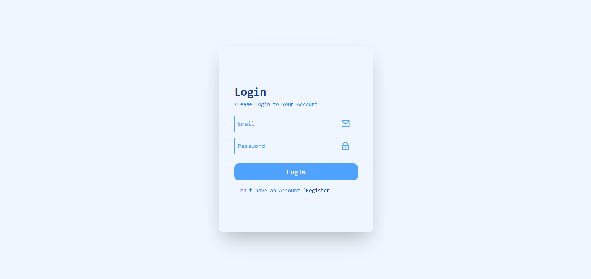
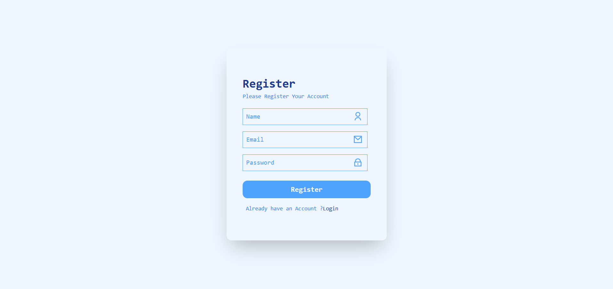
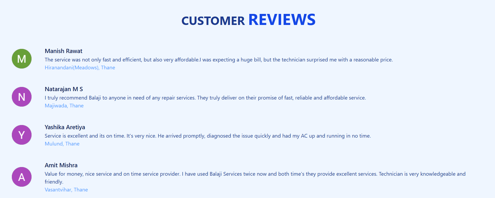
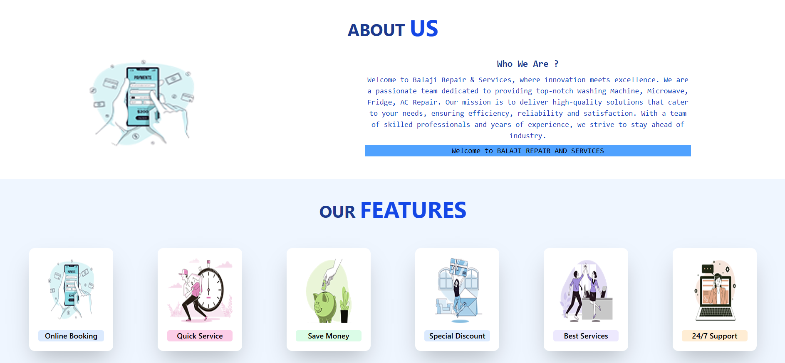
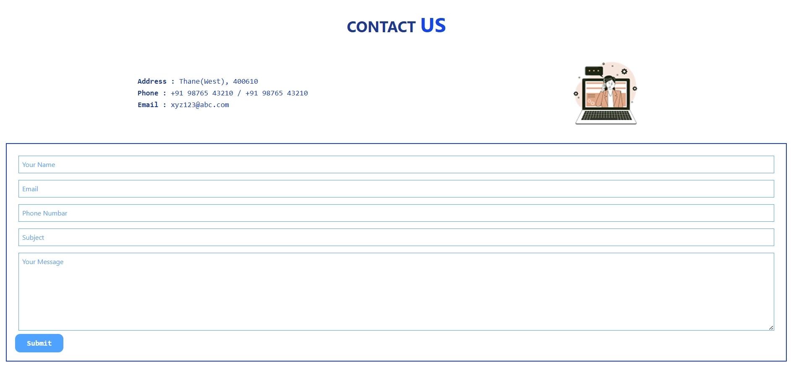
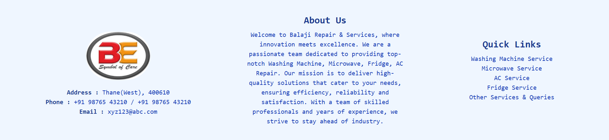

# Balaji Repair & Services

A full-stack MERN web application developed for **Balaji Repair & Services**, a home appliance repair and maintenance service center.

The website allows customers to explore available repair services, view customer reviews, learn about the company, contact the service center, and securely create and access their accounts.

## 🧭 Architecture

The project is deployed as two separate applications:

* **Frontend:** React + Vite on Vercel
* **Backend:** Express API on Render
* **Database:** MongoDB Atlas

The browser sends JSON requests to the Render API. After login, the API signs a JWT and stores it in an HTTP-only cookie. The browser sends that cookie with credentialed requests, and backend middleware verifies it before returning protected data. The frontend `ProtectedRoute` calls `GET /login` before rendering `/home`.

## 🚀 Features

* User Registration
* User Login & Logout
* JWT-based Authentication
* HTTP-only Cookie-based Token Storage
* Protected Routes
* Password Hashing using bcrypt
* User Authentication Middleware
* User Profile / Authenticated User Access
* Customer Messaging / Contact Form
* Home Appliance Service Information
* Customer Reviews
* Responsive Service-oriented UI

## 🛠️ Tech Stack

### Frontend

* React.js
* React Router
* Tailwind CSS
* Vite
* Remix Icon

### Backend

* Node.js
* Express.js
* MongoDB
* Mongoose
* JSON Web Token (JWT)
* bcrypt
* Cookie Parser
* CORS
* dotenv

## 🔐 Authentication

The application implements authentication using **JWT and HTTP-only cookies**.

The authentication flow works as follows:

1. A user registers using their name, email, and password.
2. The password is hashed using bcrypt before being stored.
3. During login, the entered password is compared with the stored hashed password.
4. A JWT is generated after successful authentication.
5. The JWT is stored in an HTTP-only cookie.
6. Protected routes verify the JWT before allowing access.
7. Users can logout by clearing the authentication cookie.

## 📂 Project Structure

```text
MERN STACK PROJECT/
│
├── Backend/
│   ├── src/
│   │   ├── db/
│   │   │   └── user.js
│   │   └── models/
│   │       ├── message.js
│   │       └── users.js
│   │
│   ├── .env
│   ├── .gitignore
│   ├── package.json
│   ├── package-lock.json
│   └── server.js
│
└── Frontend/
    ├── public/
    ├── src/
    │   ├── assets/
    │   ├── components/
    │   ├── pages/
    │   │   ├── Homepage.jsx
    │   │   ├── Loginpage.jsx
    │   │   └── Registerpage.jsx
    │   ├── App.jsx
    │   ├── index.css
    │   └── main.jsx
    │
    ├── .gitignore
    ├── eslint.config.js
    ├── index.html
    ├── package.json
    ├── package-lock.json
    └── vite.config.js
```

## 📸 Screenshots

### Login



### Register



### Home Page


### Services


### Customer Reviews



### About & Features



### Contact Us



### Footer




## ⚙️ Installation & Setup

### 1. Clone the repository

```bash
git clone https://github.com/YOUR-USERNAME/balaji-repair-services.git
cd balaji-repair-services
```

### 2. Setup Backend

```bash
cd Backend
npm install
```

Create a `.env` file inside the `Backend` folder:

```env
PORT=3000
MONGODB_URI=your_mongodb_connection_string
JWT_SECRET=your_jwt_secret
FRONTEND_URL=https://your-project.vercel.app
```

Use `Backend/.env.example` as the template. Never commit `.env`, database credentials, or JWT secrets.

Then start the backend:

```bash
npm start
```

The backend server will start on the configured port.

### 3. Setup Frontend

Open another terminal:

```bash
cd Frontend
npm install
npm run dev
```

For local development, copy `Frontend/.env.example` to `Frontend/.env` and set:

```env
VITE_API_URL=http://localhost:3000
```

The frontend will be available through the Vite development server.

## 🔗 API Endpoints

### Authentication

| Method | Endpoint    | Description            |
| ------ | ----------- | ---------------------- |
| POST   | `/register` | Register a new user    |
| POST   | `/login`    | Authenticate user      |
| GET    | `/login`    | Get authenticated user |
| POST   | `/logout`   | Logout user            |

### Messages

| Method | Endpoint    | Description               |
| ------ | ----------- | ------------------------- |
| POST   | `/messages` | Submit a customer message |

## 🔒 Security

The application includes several authentication and security-related implementations:

* Password hashing with bcrypt
* JWT-based authentication
* HTTP-only authentication cookie
* Authentication middleware
* Protected frontend routes
* Environment variables for sensitive configuration
* CORS configuration with credentials
* Input normalization and field length validation
* One-day JWT expiry
* Environment-aware cookie settings

## 🚢 Deployment

### Render backend

Set the Render root directory to `Backend` and the start command to `npm start`. Configure these environment variables in Render:

```env
NODE_ENV=production
MONGODB_URI=your_mongodb_connection_string
JWT_SECRET=your_long_random_secret
FRONTEND_URL=https://your-project.vercel.app
```

Render supplies `PORT` automatically. The `/` endpoint returns `{ "status": "ok" }` and can be used as a health check.

### Vercel frontend

Set the Vercel root directory to `Frontend`, build command to `npm run build`, and output directory to `dist`. Add:

```env
VITE_API_URL=https://your-render-service.onrender.com
```

The `vercel.json` rewrite sends frontend routes to `index.html`, allowing React Router routes such as `/home` and `/register` to work after a page refresh.

## 🎤 Interview Notes

### Why use JWT in an HTTP-only cookie?

The JWT carries the authenticated user identity and is signed by the backend. An HTTP-only cookie prevents frontend JavaScript from reading the token, reducing the impact of common XSS token theft.

### How is `/home` protected?

`ProtectedRoute` calls `GET /login` with credentials. The backend reads the `token` cookie, verifies the JWT using `JWT_SECRET`, and returns `401` when the token is missing, expired, or invalid. Only a successful response renders `Homepage`.

### Why is CORS configured with a specific origin?

The frontend and backend have different origins. The backend explicitly allows the Vercel origin and enables credentials so cookies can be sent. A wildcard origin cannot be combined with credentialed requests.

### Why hash passwords with bcrypt?

Passwords are never stored directly. bcrypt uses a one-way adaptive hash, so the server compares a submitted password with the stored hash without recovering the original password.

### What would you improve next?

The next production improvements would be request rate limiting, CSRF protection for cookie-authenticated state-changing routes, automated API tests, role-based authorization, and an admin workflow for customer messages.

## 📚 What I Learned

Through this project, I worked with:

* Building a full-stack MERN application
* Connecting React frontend with an Express backend
* Working with MongoDB and Mongoose
* Implementing user registration and login
* Password hashing using bcrypt
* JWT authentication
* HTTP-only cookies
* Protected routes
* Express middleware
* REST API development
* React Router
* Frontend-backend communication
* Environment variable configuration

## 🔮 Future Improvements

* Online service booking system
* Admin dashboard
* Service request tracking
* Email notifications
* Appointment scheduling
* Improved form validation
* Role-based authentication
* Service status tracking
* Deployment with production environment configuration

## 👨‍💻 Author

**Anshukumar Kharwar**

BScIT Graduate | MERN Stack Developer

---

⭐ If you found this project useful, consider giving the repository a star.
